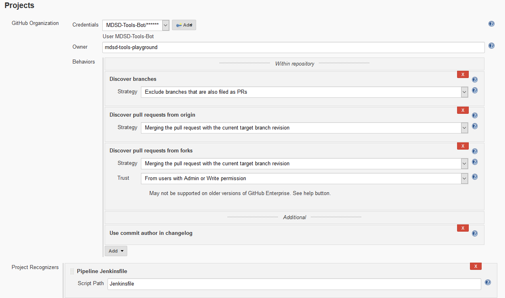

## Installed Plugins

* GitHub Authentication plugin (version 0.31)- enabling login with your Github Acount
* GitHub Integration plugin (version 0.2.4) - enabling the automated CI workflow
* Blue Ocean (version 1.9.0) - for a modern UI

## Setup Github Server

Go to Manage Jenkins > Configure Systema and add the required Github Server. As Credentials put in a generated access token from a Github User which is an Admin. This is necessary in order to be able to manage the webhooks.

## Configuration Oauth Login and Access Control

Go to manage Jenkins > Configure Global Security and activate the 'Global GitHub OAuth' Settings
Put in your values and credentials as seen in the screenshot. Do not forget to set an Admin!

more Details here: [Jenkins wiki](https://wiki.jenkins.io/display/JENKINS/Github+OAuth+Plugin)

## Project Settings

In your Project go to Configure and the following settings for branch and pull request Detection.

## Pipeline Library for a Project

If you want to use a shared Library for your Project go in your Project to configure and set the Pipeline Library Settings.

