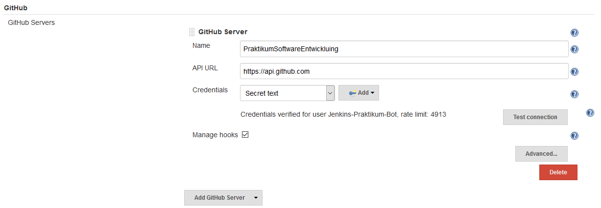
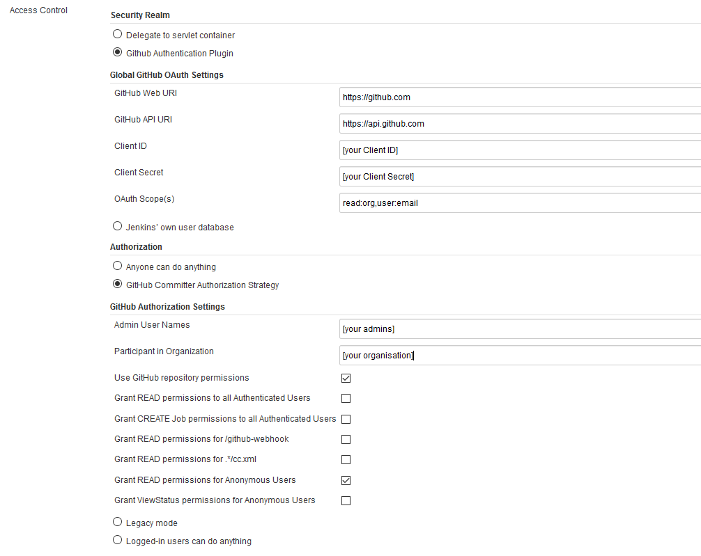
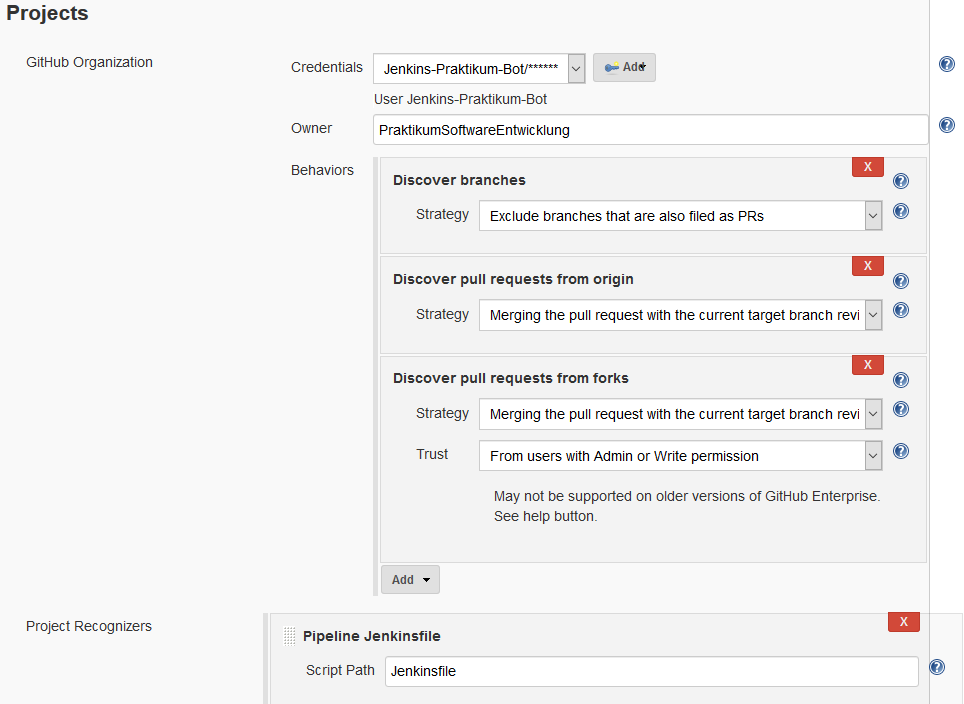
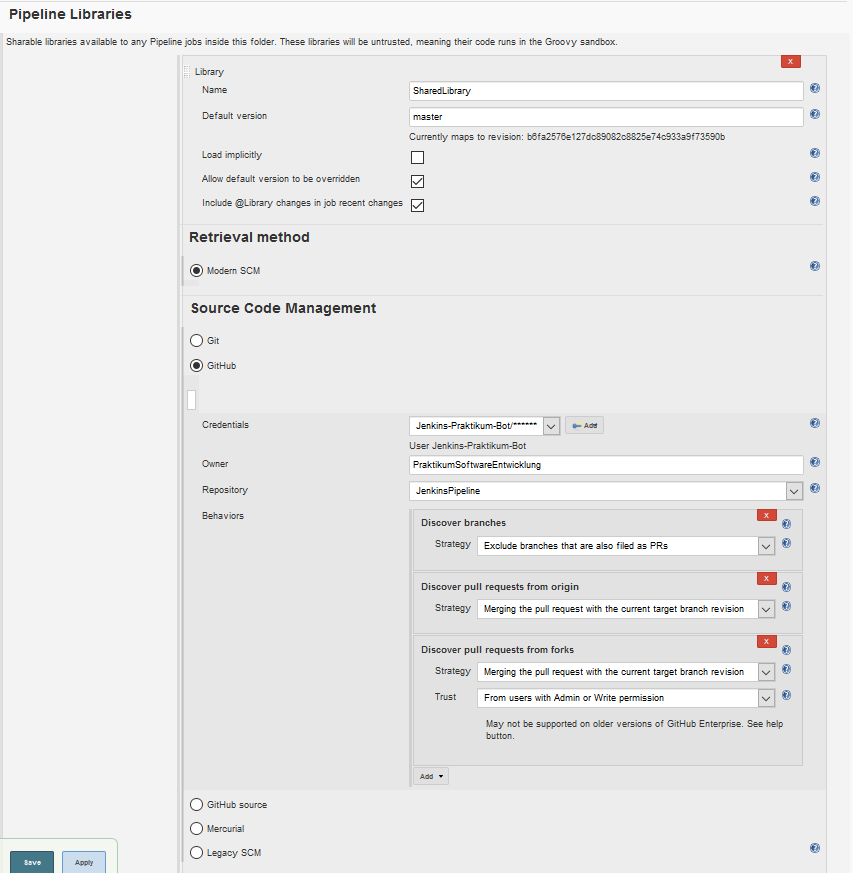

## Installed Plugins

* GitHub Authentication plugin- enabling login with your Github Acount
* GitHub Integration plugin - enabling the automated CI workflow
* Blue Ocean - for a modern UI
* Checkstyle - Code Analysis
* Jacoco - Java Code Coverage Plugin
* Email Extension - to send Email Notifications
* Publish Over SSH 

## Add Github Organization

Go to new Item > Github Organization and type in a name. Afterwards fill in all the required fields as shown below. Be aware not all fields are mentioned only the not obvious ones.

## Setup Github Server

Go to Manage Jenkins > Configure Systema and add the required Github Server. As Credentials put in a generated access token from a Github User which is an Admin. This is necessary in order to be able to manage the webhooks. If you create the access token make sure the following is selected and save the access token as secret text.
* admin:repo_hook - for managing hooks (read, write and delete old ones)
* repo - to see private repos
* repo:status - to manipulate commit statuses



## Configuration Oauth Login and Access Control

Go to manage Jenkins > Configure Global Security and activate the 'Global GitHub OAuth' Settings
Put in your values and credentials as seen in the screenshot. Do not forget to set an Admin!



more Details [here](https://wiki.jenkins.io/display/JENKINS/Github+OAuth+Plugin)

## Project Settings

In your Project go to Configure and the following settings for branch and pull request Detection. Make sure you select use commit author in changelog.



## Pipeline Library for a Project

If you want to use a shared Library for your Project go in your Project to configure and set the Pipeline Library Settings.



To use is simply put the library in your jenkinsfile. The Skip Code Quality Step is optional. All other fields are mandatory.

```groovy
@Library('SharedLibrary') _
buildPipeline {
    	sshConfigName = 'updatesites.web.mdsd.tools'
    	absoluteWebserverDir = '/home/deploy/writable'
    	webserverDir = 'simulizar'
	updateSiteLocation = 'releng/org.palladiosimulator.simulizar.updatesite/target/repository'
        skipCodeQuality = 'false'
}
```
more information [here](https://jenkins.io/doc/book/pipeline/shared-libraries/)

## Email Notification

In order to send build notifications, you have to configure a SMTP server to send mails. We use a free mail server hosted ad Zoho. In order to use it, you have to specify the following information with `EMAIL` and `PASSWORD` being placeholders:
* Configure System > Jenkins Location > System Admin e-mail address: EMAIL
* Configure System > Extended E-mail Notification
  * SMTP server: smtp.zoho.eu
  * Use SMTP Authentication: true
  * User Name: EMAIL
  * Password: PASSWORD
  * Use SSL: true
  * SMTP port: 465
  * Default Recipients
 
 
## Script Approval
 
 To get the Email Adress of the Jenkins Users in the Pipeline the following Scripts need to be approved in Manage Jenkins > In-process Script Approval:
 
 * method hudson.model.User getProperty java.lang.Class
 * method hudson.tasks.Mailer$UserProperty getAddress
 * staticMethod hudson.model.User getById java.lang.String boolean
